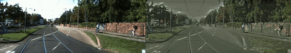

# OA-FSUI2IT: A Novel Few-Shot Cross Domain Object Detection Framework with Object-aware Few-shot Unsupervised Image-to-Image Translation


<br><br><br><br>


<br><br>

## Introdcution

This repository contains our PyTorch implementation of Object-Aware Few-Shot Unsupervised Image-to-Image Translation (OA-FSUI2IT). In this paper, we try to address the few-shot cross domain (FSCD) object detection task with limited unlabeld images in the target domain. Built upon the architecture of [CUT](https://github.com/taesungp/contrastive-unpaired-translation), our method 1) introduces adaptive discriminator augmentation module to solve the unbalanced source-target domain problem; 2) proposes patch pyramid contrastive learning startegy to improve the images quality; and 3) develops self-supervised content-consistency loss to enforce content matching.  Trained on the images translated by our OA-FSUI2IT, object detection methods (i.e. Faster RCNN, FCOS, YOLOv3) can achieve better mAP than those trained on source only, as well as those on CUT translated images. As the processing time for our detection framework is determined by the inference time of the employed detector, it can be used for online object detection. 

<br>

### **FSCD Object Detection Framework**


<br><br><br>
<br><br>&nbsp;

### **Network Architecture**


## Getting Started
+  Clone this repo:
   ```
   git clone https://github.com/anonymous-cvlab/FSCD-Det.git OA-FSUI2IT
   cd OA-FSUI2IT
   ```
+ Install PyTorch 1.1 and other dependencies (e.g., torchvision, visdom, dominate, gputil).

   For pip users, please type the command 
   
   ```
   pip install -r requirement.txt
   ```

   For Conda users, you can create a new Conda environment using 
   ```
   conda env create -f environment.yml
   ```

<br>

## Ablation Study

We implement  the ablation study to investigate the effectiveness of each modules in OA-FSUI2IT. We use the Normal-to-Foggy (Cityscapes->FoggyCityscapes) task as a study case. Note that all of them are trained with ResNet50 backbone.


|  <sub> &nbsp;&nbsp;&nbsp;Method&nbsp;&nbsp;&nbsp; </sub> | <sub><sub> Discriminator Augmentation </sub></sub> | <sub><sub> Patch Pyramid Contrastive Learning </sub></sub> | <sub><sub>Self-Supervised Content-Consistency Loss </sub> </sub> | <sub>  mAP </sub> | <sub>  person </sub> | <sub>  rider </sub> | <sub>  car </sub> | <sub>  truck </sub> | <sub>  bus </sub> | <sub>  train </sub> | <sub>  mcycle </sub> | <sub>  bicycle </sub> | 
|:-------------:|----------------------------|------------------------------------|------------------------------------------|---------|:-------:|:------:|:----:|:------:|:----:|:------:|:-------:|----------|
|  <sub>    CUT    </sub> | <sub> &cross;  </sub> | <sub> &cross; </sub> | <sub> &cross;  </sub> | <sub>   39.5  </sub> | <sub>   44.5  </sub> | <sub>  53.4  </sub> | <sub> 58.3 </sub> | <sub>  22.8  </sub> | <sub> 36.6 </sub> | <sub>  14.9  </sub> | <sub>   34.4  </sub> | <sub>   51.3   </sub> | <sub>
| <sub> OA-FSUI2IT </sub> | <sub> &check; </sub> | <sub> &cross; </sub> | <sub> &cross;  </sub> | <sub>   41.1  </sub> | <sub>   47.2  </sub> | <sub>  52.3  </sub> | <sub> 61.7 </sub> | <sub>  28.7  </sub> | <sub> 44.6 </sub> | <sub>  15.1  </sub> | <sub>   30.5  </sub> | <sub>   48.9   </sub> | <sub>
| <sub> OA-FSUI2IT </sub> | <sub> &cross; </sub> | <sub> 6  </sub> | <sub> &cross;  </sub> | <sub>   41.0  </sub> | <sub>   46.6  </sub> | <sub>  52.6  </sub> | <sub> 63.7 </sub> | <sub>  24.5  </sub> | <sub> 40.8 </sub> | <sub>  17.7  </sub> | <sub>   32.0  </sub> | <sub>   49.7   </sub> | <sub>
| <sub> OA-FSUI2IT </sub> | <sub> &cross; </sub> | <sub> &cross; </sub> | <sub> &check;  </sub> | <sub>   39.0  </sub> | <sub>   47.5  </sub> | <sub>  53.8  </sub> | <sub> 59.0 </sub> | <sub>  21.9  </sub> | <sub> 39.4 </sub> | <sub>  17.9  </sub> | <sub>   27.1  </sub> | <sub>   49.0   </sub> | <sub>
| <sub> OA-FSUI2IT </sub> | <sub> &check; </sub> | <sub> 6  </sub> | <sub> &cross;  </sub> | <sub>   41.3  </sub> | <sub>   47.0  </sub> | <sub>  54.6  </sub> | <sub> 64.6 </sub> | <sub>  25.9  </sub> | <sub> 40.5 </sub> | <sub>  15.3  </sub> | <sub>   31.6  </sub> | <sub>   51.3   </sub> | <sub>
| <sub> OA-FSUI2IT </sub> | <sub> &check; </sub> | <sub> 6  </sub> | <sub> &check;  </sub> | <sub>   41.4  </sub> | <sub>   46.5  </sub> | <sub>  51.8  </sub> | <sub> 62.6 </sub> | <sub>  28.1  </sub> | <sub> 40.9 </sub> | <sub>  20.9  </sub> | <sub>   30.8  </sub> | <sub>   49.3   </sub> | <sub>
| <sub> OA-FSUI2IT </sub> | <sub> &cross; </sub> | <sub> 9  </sub> | <sub> &cross;  </sub> | <sub>   41.7  </sub> | <sub>   44.9  </sub> | <sub>  51.3  </sub> | <sub> 63.0 </sub> | <sub>  27.7  </sub> | <sub> 46.1 </sub> | <sub>  18.2  </sub> | <sub>   34.3  </sub> | <sub>   48.2   </sub> | <sub>
| <sub> OA-FSUI2IT </sub> | <sub> &check; </sub> | <sub> 9  </sub> | <sub> &check;  </sub> | <sub>  42.3  </sub> | <sub>   47.5  </sub> | <sub>  53.8  </sub> | <sub> 64.1 </sub> | <sub>  27.8  </sub> | <sub> 45.9 </sub> | <sub>  11.5  </sub> | <sub>   35.9  </sub> | <sub>   52.3   </sub> |


In the first six rows, we show how different modules work alone and interact with each other. As we can see in the table, the performance gradually increase as more modules involving. From 5th row to 8th row, we present the impact of different numbers in patch pyramid contrastive learning. The more patches there are, the more mAP increment our OA-FSUI2IT can achieve.

   
## Performance

Here we display the detection results given by different detectors trained on Cityscapes datasets which has been translated to foggy style by our OA-FSUI2IT. We select two-staged detector, Faster RCNN, one-staged anchor-based detector, YOLOv3, and one-staged anchor-free detector FCOS to show OA-FSUI2IT's versatility.
   
Note that Bold means the best score other than Oracle.

### Cityscapes Clear to Foggy 
| **FasterRCNN<br>  Cityscapes**  |  mAP  | person | rider | car  | truck  | bus  | train | motorcycle | bicycle |
|:-----------------------------:|-------|--------|-------|------|--------|------|-------|------------|--------|
| Source                         | 30.0 | 38.6 | 45.1 | 44.9 | 18.8 | 24.6 |   2.8 | 23.5 | 42.0 |
| CycleGAN                   | 19.7 | 23.2 | 29.8 | 49.0 |   4.9 | 19.1 |   0.4 |    6.2 | 24.9 |
| DCLGAN                     | 35.2 | 39.7 | 50.3 | 56.7 | 18.9 | 34.1 | 13.9 | 22.7 | 45.4 |
| CUT                              | 39.5 | 44.5 | 53.4 | 58.3 | 22.8 | 36.6 | **14.9** | 34.4 | 51.3 |
| OA-FSUI2IT                | **42.3** | **47.5** | **53.8** | **64.1** | **27.8** | **45.9** | 11.5 | **35.9** | **52.3** |
| Oracle                         | 48.6 | 53.1 | 59.9 | 71.1 | 31.3 | 48.5 | 29.1 | 39.8 | 55.8 |

| **FCOS<br> &nbsp;Cityscapes&nbsp;** | mAP  | person | rider | car  | truck  | bus  | train | motorcycle | bicycle |
|:---------------------:|--------|--------|--------|--------|--------|--------|------|------|--------|
| Source               | 14.9 | 21.9 | 17.0 | 29.9 |   2.8 | 11.5 | 0.5 | 6.1 | 25.1 |
| CUT                    | 23.3 | 33.1 | 30.6 | 48.3 |   7.6 | 23.6 | 1.7 | 6.4 | 34.9 |
| OA-FSUI2IT      |**26.8**|**36.7**|**35.4**|**56.2**|**11.3**|**25.3**|**1.7**|**12.8**|**35.0d**|
| Oracle                | 30.5 | 40.5 | 38.8 | 61.1 | 14.9 | 33.0 | 11.0 | 8.4 | 36.2 |


| **YOLO<br> &nbsp;Cityscapes&nbsp;** | mAP  | person | rider | car  | truck  | bus  | train | motorcycle | bicycle |
|:--------------------:|--------|--------|--------|--------|--------|--------|--------|--------|--------|
| Source              | 27.2 | 29.5 | 38.3 | 41.4 | 18.0 | 28.9 | 5.0   | 22.9 | 33.8 |
| CUT                   | 34.3 | 33.9 | **43.2** | 51.9 | **23.2** | 40.3 | 17.8 | **27.2** | 36.4 |
| OA-FSUI2IT     | **36.8** | **34.9** | 42.7 | **56.6** | 21.2 | **48.1** | **32.9** | 20.9 | **37.1** |
| Oracle              | 42.2 | 38.2 | 47.5 | 60.6 | 30.9 | 47.7 | 36.8 | 35.4 | 40.3 |

### BDD100k Daytime to Night

| **FasterRCNN <br>BDD100k** | mAP@50 | bike | bus  | car  | motor | person | rider | traffic light | traffic sign | truck |
|:-------------------:|--------|--------|--------|--------|------|--------|--------|--------|--------|------|
| Source            | 26.4 | 22.0 | 21.7 | 53.0 | 9.5 | 33.9 | 15.3 | 12.8 | 40.6 | 29.3 |
| CUT                 | 26.3 | 22.6 | 27.2 | 52.2 | 4.5 | 36.3 | 12.5 | 10.0 | 42.3 | 29.4 |
| OA-FSUI2IT   | **30.5** | **27.5** | **28.2** | **53.3** | **16.2** | **39.7** | **20.7** | **13.0** | **43.7** | **32.1** |
| Oracle            | 48.0 | 44.3 | 46.8 | 73.7 | 36.0 | 55.8 | 26.9 | 37.8 | 58.0 | 52.7 |

| **FCOS <br>&nbsp;&nbsp;&nbsp;BDD100k&nbsp;&nbsp;&nbsp;** | mAP@50 | bike | bus  | car  | motor | person | rider | traffic light | traffic sign | truck |
|:------------------:|--------|--------|-------|---------|-------|--------|---------|--------|--------|-------|
| Source           | 17.1 |   9.7 | 10.4 | 44.4 |   1.4 | 24.9 |    5.9 | 13.3 | 40.3 | 21.2 |
| CUT                | 14.3 |   5.3 |    9.1 | 42.7 |   0.5 | 21.4 |    5.5 |   6.7 | 34.0 | 17.2 |
| OA-FSUI2IT  | **24.3** | **17.4** | **17.1** | **49.7** |   **5.0** | **34.1** | **10.3** | **15.6** | **43.1** | **26.1** |
| Oracle           | 42.5 | 27.6 | 45.6 | 73.6 | 29.2 | 52.5 | 20.9 | 57.9 | 67.0 | 51.1 |

| **YOLO <br>&nbsp;&nbsp;&nbsp;BDD100k&nbsp;&nbsp;&nbsp;**  | mAP@50 | bike | bus  | car  | motor | person | rider | traffic light | traffic sign | truck |
|:-------------------:|--------|--------|--------|--------|--------|--------|-------|---------|--------|-------|
| Source             | 24.4 | 20.9 | 24.7 | 51.0 |   **8.6** | 29.9 | 16.2 | **19.3** | **42.2** | 31.2 |
| CUT                  | 18.3 | 10.6 | 23.9 | 47.4 |   5.9 | 24.1 |    9.1 | 8.0   | 31.1 | 22.6 |
| OA-FSUI2IT    | **28.6** | **28.6** | **30.3** | **53.4** |  8.3 | **32.1** | **20.4** | 17.9 | 39.5 | **33.4** |
| Oracle             | 40.9 | 37.0 | 40.3 | 67.2 | 34.7 | 45.3 | 30.2 | 46.0 | 59.6 | 49.1 |

### Kitti to Cityscapes 

| **FasterRCNN<br> KITTI** | mAP@50 | person | rider | car | train |
|:----------------:|--------|--------|--------|--------|--------|
| Source                | 20.3 | 25.3 | **18.2** | 37.5 |   0.1 |
| CUT                     | 21.7 | 22.6 | 12.6 | 36.1 | 16.4 |
| OA-FSUI2IT       | **26.3** | **27.5** | 16.9 | **42.3** | **18.6** |
| Oracle                | 54.8 | 57.4 | 63.4 | 74.0 | 24.5 |

| **&nbsp;&nbsp;&nbsp;&nbsp;&nbsp;&nbsp;FCOS&nbsp;&nbsp;&nbsp;&nbsp;&nbsp;&nbsp;&nbsp; <br>KITTI** | mAP@50 | person | rider | car | train |
|:------------------:|--------|--------|--------|--------|------|
| Source           | 20.3 | 22.8 | **18.9** | 38.8 | 0.6 |
| CUT                | 18.5 | 18.9 | 12.0 | 41.3 | 1.9 |
| OA-FSUI2IT  | **21.9** | **24.3** | 14.3 | **42.7** | **4.2** |
| Oracle           | 44.3 | 49.0 | 52.6 | 66.7 | 9.0 |

| **&nbsp;&nbsp;&nbsp;&nbsp;&nbsp;&nbsp;YOLO&nbsp;&nbsp;&nbsp;&nbsp;&nbsp;&nbsp;  <br>KITTI** | mAP@50 | person | rider | car | bus   |
|:------------------:|--------|--------|--------|--------|--------|
| Source           | 19.4 | 19.4 | 16.7 | 37.0 |   4.5 |
| CUT                | 15.9 | 14.1 |    7.5 | 40.5 |   1.3 |
| OA-FSUI2IT  | **21.3** | **17.1** | **12.4** | **41.8** | **13.8** |
| Oracle           | 47.5 | 42.9 | 49.3 | 65.9 | 31.9 |

   
## Translation Results

### Cityscapes Normal to Foggy
<p float='left'>


</p>


### BDD100k Daytime to Nighttime
<p float='left'>


</p>


### Kitti to Cityscapes
<p float='left'>


</p>



## Few-Shot Cross Domain Object Detection Results

### Cityscapes Clear to Foggy


### BDD100k Day to Night


### KITTI to Cityscapes


### Detection Error Analysis

   We use [TIDE](https://github.com/dbolya/tide) to further analysis the detailed aspect where our method is improving during detection. The table listed below is the relative and absolute error contributions to the detection results on Cityscapes->FoggyCityscapes produced by TIDE. 


<sub>

| &nbsp;&nbsp;&nbsp;&nbsp;&nbsp;&nbsp;Type&nbsp;&nbsp;&nbsp;&nbsp;&nbsp;&nbsp;      | Cls          | Loc          | Both        | Dupe        | Bkg         | Miss          | FP    | FN    |
|:---------:|--------------|--------------|-------------|-------------|--------|--------------------|-------|-------|
| Source    | 4.79 | 4.14 | 0.56 | 0.15 | 0.23| 30.57 | 8.36  | 41.60 |
|                  | 11.84%| 10.24%| 1.38% | 0.37% | 0.57% | 75.59% |||
| CUT       | 6.99| 6.39 | 0.90 | 0.19 | 0.59 | 20.46 | 12.82 | 32.90 |
|                 |19.68% | 17.99% | 2.53% | 5.34% | 1.66% | 57.60%|||
| OA-FSUI2IT | 6.64 | 6.59| 1.59 | 0.22 | 0.78 | 16.14 | 16.14 | 27.99 |
| |  20.78%| 20.63% | 4.97% | 0.69% | 2.44% | 50.50%| ||

</sub>
   
<p float='left'>


</p>

## Feature distributions visualization
To validate our translation method, we use t\-SNE to visualize distribution of images from source domain, target domain and generated. We use [pixplot](https://github.com/YaleDHLab/pix-plot) for t\-SNE visualization.

### Cityscapes Normal to Foggy
[](https://github.com/anonymous-cvlab/FSCD-Det/tree/main/imgs/tsne_results/cityscapes_clear_and_foggy_and_fake_scaled3.png)

### BDD100k Daytime Clear to Nighttime Clear
[](https://github.com/anonymous-cvlab/FSCD-Det/tree/main/imgs/tsne_results/bdd100k_day_and_night_and_fake_scaled3.png)

### Kitti to Cityscapes
[](https://github.com/anonymous-cvlab/FSCD-Det/tree/main/imgs/tsne_results/kitti_and_fake_kitti_and_cityscapes_scaled3.png)


## Time Analysis
We use MMDetection's default settings of Faster RCNN (short side 600)/FCOS (short side 800)/YOLOv3 (short side 608) with ResNet50 backbone and test the inference speed on a single NVIDIA V100 GPU.

||FPS|ms/img|
|:---:|:---:|:---:|
|FasterRCNN|22.5|44.44|
|FCOS|22.9|43.67|
|YOLOv3|49.4|20.24|


## Acknowledgments
Our code is developed based on [contrastive-unpaired-translation](https://github.com/taesungp/contrastive-unpaired-translation/). Part of adaptive discriminator augmentation borrows from [stylegan2-ada-pytorch](https://github.com/NVlabs/stylegan2-ada-pytorch). 
   
